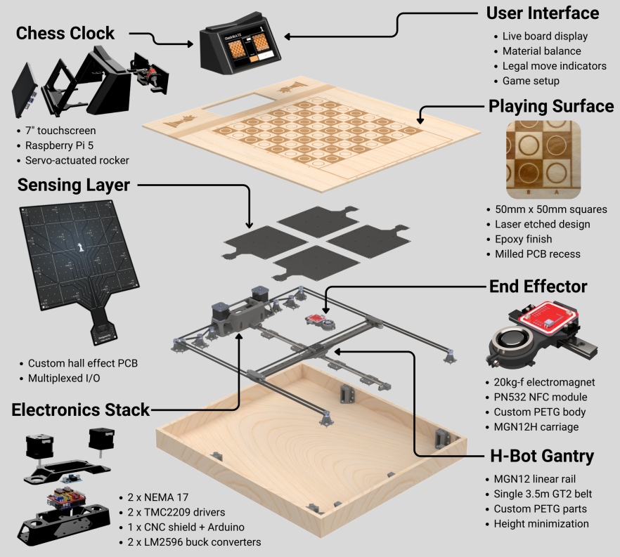

# Check-M.A.T.E
<p align="center">
  
</p>
<p align="center">
  <span style="font-size:1.2em;"><em>A Mechanically Articulated Tabletop Experience</em></span>
</p>

## Overview

Check-M.A.T.E is an automated chessboard that bridges the gap between online and physical chess. This project integrates a hardware abstraction layer and control with an intuitive UI for seamless interaction.

## How It Works

1. **Piece Detection**: Hall effect sensors detect the position of chess pieces on the board.
2. **Move Validation**: The chess backend validates moves using `python-chess` and updates the game state.
3. **Piece Movement**: Stepper motors, driven by a custom build of grbl, move pieces to their new positions via the electromagnet on the end-effector.
4. **Piece Identification**: An NFC reader identifies pieces.
5. **Chess Engine Integration**: Stockfish provides moves for single-player games.


<p align="center">
  
</p>
<p align="center">
  <em>System Overview</em>
</p>


## Features
- Finite State Machine Frontend
- Chess backend
- Custom screens and widgets
- Hardware Abstraction Layer (HAL)

## Installation

```bash
# Clone the repository
git clone https://github.com/ryanbrown919/CHECKMATE.git

# Navigate to project directory
cd CHECKMATE

# Install dependencies
pip install kivy chess berserk lgpio pyserial
```

## Usage

1. Connect your Raspberry Pi 5 to required peripherals
2. Run the main application:
   ```bash
   python checkmate.py
   ```
3. Access the UI through the connected display 

### Project Structure
```
CHECKMATE/
├── assets/         # Images/figures
├── bin/            # Stockfish binary
├── firmware        # Sense board firmware
├── checkmate/      # Application
├── test/           # Unit tests
└── checkmate.py    # Entry Point
```


